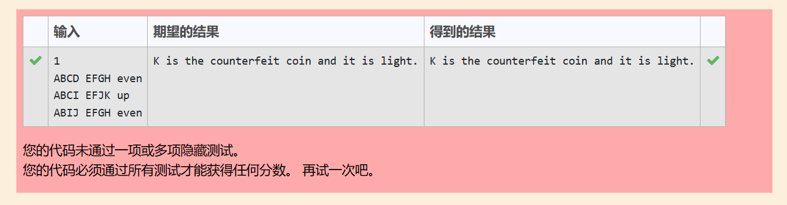

## 枚举 Enumerate \ 假币问题 Counterfeit Coin
### 题目描述
赛利有12枚银币。其中有11枚真币和1枚假币。假币看起来和真币没有区别，但是重量不同。但赛利不知道假币比真币轻还是重。于是他向朋友借了一架天平。朋友希望赛利称三次就能找出假币并且确定假币是轻是重。例如:如果赛利用天平称两枚硬币，发现天平平衡，说明两枚都是真的。如果赛利用一枚真币与另一枚银币比较，发现它比真币轻或重，说明它是假币。经过精心安排每次的称量，赛利保证在称三次后确定假币。
### 输入
第一行有一个数字n，表示有n组测试用例。
对于每组测试用例：
输入有三行，每行表示一次称量的结果。赛利事先将银币标号为A-L。每次称量的结果用三个以空格隔开的字符串表示：天平左边放置的硬币 天平右边放置的硬币 平衡状态。其中平衡状态用 `up`, `down` 或 `even` 表示, 分别为右端高、右端低和平衡。天平左右的硬币数总是相等的。
### 输出
输出哪一个标号的银币是假币，并说明它比真币轻还是重(heavy or light)。
### 要求
<table>
<tr>
<td>输入</td>
<td>结果</td>
</tr>
<tr>
<td>1 <br> ABCD EFGH even <br> ABCI EFJK up<br> ABIJ EFGH even</td>
<td> K is the counterfeit coin and it is light.</td>
</tr>
</table>

### 实现结果
<div align=left>

</div>

### 实现代码
```c
#include <stdio.h>
#include <stdlib.h>
#include <stdbool.h>
#include<string.h>

typedef struct makemake_try make_try;

typedef struct judgeRes res;

struct makemake_try{
    char onLeft[3][10];
    char onRight[3][10];
    char res[3][10];
};

struct judgeRes{
    bool res;
    char condition[20];
};

make_try init(){
    make_try t;
    for(int i = 0; i < 3; i++){
        scanf("%s   %s   %s", t.onLeft[i], t.onRight[i], t.res[i]);
    }
    return t;
}

res notCounterfeit(res r){
    r.res = false;
    return r;
}

res isCounterfeit(res r, char * condition){
    r.res = true;
    strcpy(r.condition, condition);
    return r;
}

res judgeCounterfeit(char c, make_try t){
    res r;
    int index;
    for(int i = 0; i < 3; i++){
        switch(t.res[i][0]){
        case 'e':
            if(strchr(t.onLeft[i], c) || strchr(t.onRight[i], c)){
                r = notCounterfeit(r);
                return r;
            }
            break;
        default:
            index = i;
            if(strchr(t.onLeft[i], c) == NULL && strchr(t.onRight[i], c) == NULL){
                r = notCounterfeit(r);
                return r;
            }
            break;
        }
    }
    switch(t.res[index][0]){
    case 'u':
        if(strchr(t.onLeft[index], c)){
            r = isCounterfeit(r, (char*)"heavy");
        }
        else{
            r = isCounterfeit(r, (char*)"light");
        }
        break;
    default:
        if(strchr(t.onLeft[index], c)){
            r = isCounterfeit(r, (char*)"light");
        }
        else{
            r = isCounterfeit(r, (char*)"heavy");
        }
        break;
    }
    return r;
}

void circle(){
    make_try t = init();
    char c;
    for(c = 'A'; c <= 'L'; c++){
        res r = judgeCounterfeit(c, t);
        if(r.res){
            printf("%c is the counterfeit coin and it is %s.\n", c, r.condition);
            break;
        }
    }
}

int main()
{
    int times;
    scanf("%d", &times);
    while(times){
        circle();
        times--;
    }
    return 0;
}

```